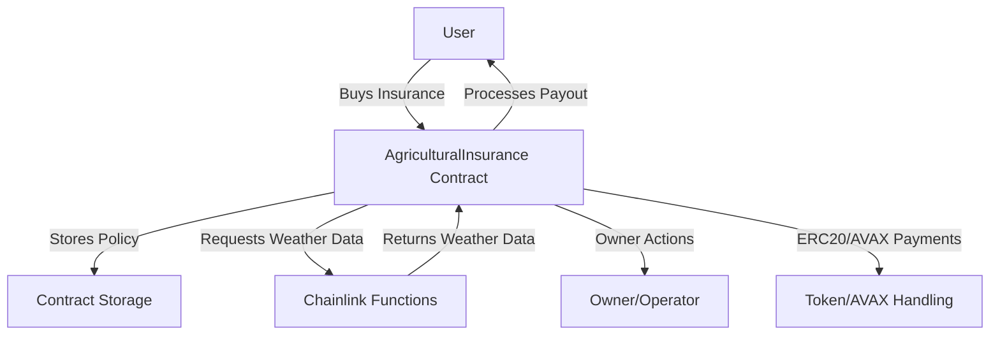

# Defi Insurance Smart Contracts

<p align="center">
  <a href="https://defi-insurance.bamboosoft.io/" target="blank"></a>
</p>

## Overview
- [Defi Insurance Smart Contracts](#defi-insurance-smart-contracts)
  - [Overview](#overview)
  - [About Project](#about-project)
  - [Getting Started](#getting-started)
    - [Prerequisites](#prerequisites)
    - [Installation](#installation)
      - [1. Install Node.js (v18 or higher)](#1-install-nodejs-v18-or-higher)
      - [2. Clone the repository and install dependencies](#2-clone-the-repository-and-install-dependencies)
    - [Compile Contracts](#compile-contracts)
    - [Run Tests](#run-tests)
    - [Deploy Contracts](#deploy-contracts)
  - [Environment Variables](#environment-variables)
  - [Architecture](#architecture)
  - [Resources](#resources)
  - [Support](#support)
  - [Stay in touch](#stay-in-touch)
  - [License](#license)

## About Project
Defi Insurance Smart Contracts power a decentralized insurance platform on the Avalanche blockchain, enabling transparent, secure, and automated insurance for agricultural risks. The core contract, `AgriculturalInsurance`, allows users to purchase insurance using AVAX or ERC20 tokens, leverages Chainlink Functions for weather data, and supports automated payouts based on real-world events.

**Built with:**
-  [Hardhat](https://hardhat.org/)
-  [TypeScript](https://www.typescriptlang.org/)
-  [Solidity](https://docs.soliditylang.org/)
-  [Chainlink](https://chain.link/)
-  [OpenZeppelin](https://openzeppelin.com/)
- Avalanche Blockchain

## Getting Started

### Prerequisites
- Node.js >= 18
- npm or Yarn

### Installation
If you don't have Node.js or npm installed, follow these steps:

#### 1. Install Node.js (v18 or higher)
- Download and install from [nodejs.org](https://nodejs.org/)
- Or, using nvm (Node Version Manager):
  ```bash
  # Install nvm if you don't have it
  curl -o- https://raw.githubusercontent.com/nvm-sh/nvm/v0.39.5/install.sh | bash
  # Restart your terminal, then:
  nvm install 18
  nvm use 18
  ```

#### 2. Clone the repository and install dependencies
```bash
git clone https://github.com/Bamboo-Software/defi-insurance-smartcontract
cd defi-insurance-smartcontract
npm install
# or
yarn install
```

### Compile Contracts
```bash
npx hardhat compile
```

### Run Tests
```bash
npx hardhat test
```

### Deploy Contracts
```bash
# Example: Deploy to Avalanche Fuji Testnet
npx hardhat run --network fuji scripts/source.js
```

## Environment Variables
Create a `.env` file in the project root with the following variables:

```env
PRIVATE_KEY=your_private_key_here
FUJI_RPC=https://api.avax-test.network/ext/bc/C/rpc
MAINNET_RPC=https://api.avax.network/ext/bc/C/rpc
```

## Architecture

The following diagram illustrates the high-level architecture of the Defi Insurance smart contract system:



## Resources
- [Hardhat Documentation](https://hardhat.org/getting-started/)
- [Solidity Documentation](https://docs.soliditylang.org/)
- [Chainlink Documentation](https://docs.chain.link/)
- [OpenZeppelin Contracts](https://docs.openzeppelin.com/contracts/)
- [Avalanche Docs](https://docs.avax.network/)

## Support

This project is open source and community-driven. For questions and support:
- [Hardhat Discord](https://discord.gg/A4fBkyQ)
- [Chainlink Discord](https://discord.gg/chainlink)
- [Avalanche Discord](https://chat.avax.network/)

## Stay in touch
- Website - [https://defi-insurance.bamboosoft.io/](https://defi-insurance.bamboosoft.io/)
- Author - Dong Khong Minh, Hoang Nguyen Van, Loi Phan Van, Cuong Tran Xuan
- Team website: https://bamboosoft.io/

## License

This project is [ISC licensed](https://opensource.org/licenses/ISC).
